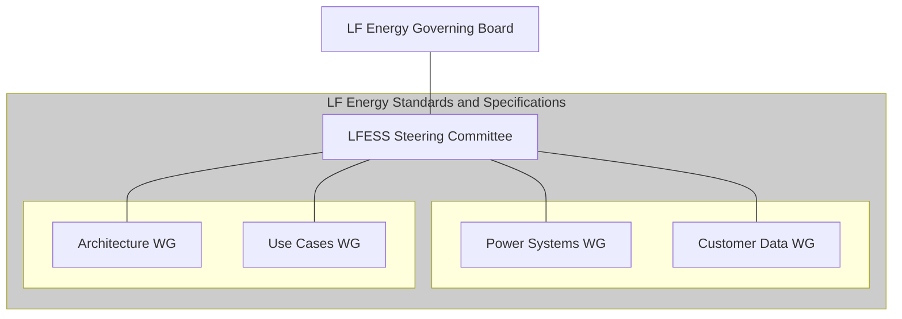

# LFESS Governance

LF Energy Standards and Specifications (LFESS) is structured as a Series LLC entity underneath the Joint Development Foundation Projects, LLC entity, a similar legal entity structure used for technical projects hosted at the LF Energy Foundation. Please refer

## Governance structure

The below chart describes the governance structure.

### LF Energy Governing Board

The role of the LF Energy Governing Board is to provide fiduciary and legal oversight for LFESS. Specifically, it has these primary roles.

- Define the process and requirements for Steering Membership ( detailed at https://github.com/lf-energy/foundation/blob/main/lfess-steering-committee-appointment-policy.md ).
- Handle funding and infrastructure requests and incorporate those into the overall budget of LF Energy.

### LFESS Steering Committee

The LFESS Steering Committee provides oversight of the working groups within LFESS, with the primary role of ensuring the working groups have the resources needed to build the specifications. Specific duties of the LFESS Steering Committee include:

- Approve the creation of new working groups
- Maintain a lifecycle for working groups
- Approve specification publication
- 