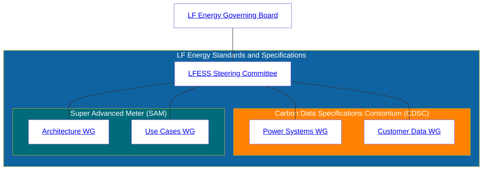

# LFESS Governance

LF Energy Standards and Specifications (LFESS) is structured as a Series LLC entity underneath the Joint Development Foundation Projects, LLC entity, a similar legal entity structure used for technical projects hosted at the LF Energy Foundation. Please refer

## Governance structure

The chart below describes the governance structure.

### LF Energy Governing Board

The role of the LF Energy Governing Board is to provide fiduciary and legal oversight for LFESS. Specifically, it has these primary roles.

- Define the process and requirements for Steering Membership ( detailed at https://github.com/lf-energy/foundation/blob/main/lfess-steering-committee-appointment-policy.md ).
- Handle funding and infrastructure requests and incorporate those into LF Energy's overall budget.

### LFESS Steering Committee

The LFESS Steering Committee provides oversight of the working groups within LFESS, with the primary role of ensuring the working groups have the resources needed to build the specifications. Specific duties of the LFESS Steering Committee include:

- Approve the creation of new working groups
- Maintain a lifecycle for working groups
- Approve specification publication
- Assess any resource or infrastructure needs for the working groups, escalating them to the [LF Energy Governing Board](#lf-energy-governing-board) as needed.

### Working Groups

Working Groups are where the primary work of building the specification happens. The working groups are open to anyone, and there are no financial requirements or corporate affiliation needs for participation. Participation includes signing up for mailing lists, joining Slack channels, or participating in a working group or community meeting. These groups are open and transparent; each group defines how to participate in their individual working group repositories.

A membership is required if someone wants to contribute to a specification. Contributing to a specification is defined as anything said or written by a person that would be incorporated into a specification. Examples could include:

- A new issue or pull request opened requesting a change to a specification
- Comments on an issue or pull request that is making a change to a specification.
- Comments shared during a meeting that are directly incorporated into a specification.

Current working groups can be found at [WORKINGGROUPS.md](WORKINGGROUPS.md).

## Membership

Moved to [CONTRIBUTING.md](CONTRIBUTING.md)
